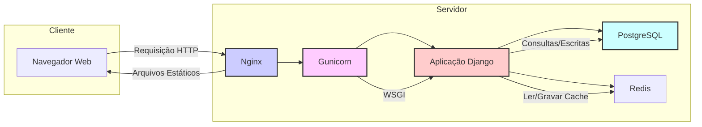
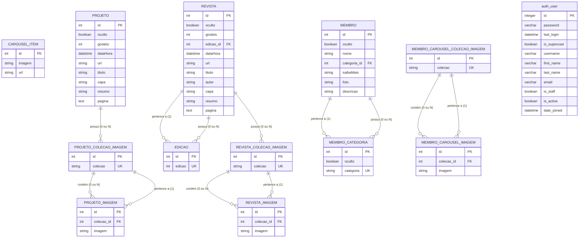
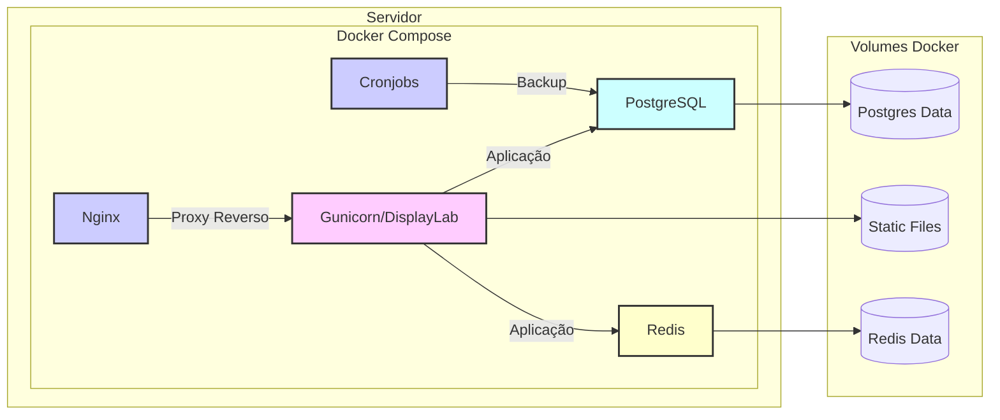

# Índice

- [Visão Geral](#visão-geral)
- [Componentes Principais e Tecnologias Utilizadas](#componentes-principais-e-tecnologias-utilizadas)
  - [Frontend (Templates e Static Files)](#frontend-templates-e-static-files)
  - [Backend (Django Apps)](#backend-django-apps)
  - [Banco de Dados (PostgreSQL)](#banco-de-dados-postgresql)
  - [Cache (Redis)](#cache-redis)
  - [Servidor Web (Nginx)](#servidor-web-nginx)
  - [Servidor de Aplicação (Gunicorn)](#servidor-de-aplicação-gunicorn)
  - [Outras Dependências](#outras-dependências)
- [Diagrama de Componentes](#diagrama-de-componentes)
- [Estrutura do Projeto](#estrutura-do-projeto)
- [Análise Detalhada da Estrutura do Projeto](#análise-detalhada-da-estrutura-do-projeto)
  - [1. `app/` (Aplicação Django Principal)](#1-app-aplicação-django-principal)
    - [1.1. `DisplayLab/` (Configurações do Projeto)](#11-displaylab-configurações-do-projeto)
    - [1.2. `contentManagement/` (App de Gerenciamento de Conteúdo)](#12-contentmanagement-app-de-gerenciamento-de-conteúdo)
      - [1.2.1. `forms/`](#121-forms)
        - [1.2.1.1. `home/`](#1211-home)
        - [1.2.1.2. `projetos/`](#1212-projetos)
        - [1.2.1.3. `revista/`](#1213-revista)
        - [1.2.1.4. `sobre/`](#1214-sobre)
      - [1.2.2. `views/`](#122-views)
        - [1.2.2.1. `viewsHome.py`](#1221-viewshomepy)
        - [1.2.2.2. `viewsProjetos.py`](#1222-viewsprojetospy)
        - [1.2.2.3. `viewsRevista.py`](#1223-viewsrevistapy)
        - [1.2.2.4. `viewsSobre.py`](#1224-viewssobrepy)
      - [1.2.3. `static/`](#123-static)
      - [1.2.4. `templates/`](#124-templates)
    - [1.3. `global/` (Arquivos Globais)](#13-global-arquivos-globais)
      - [1.3.1. `static/`](#131-static)
      - [1.3.2. `templates/`](#132-templates)
    - [1.4. `main/` (App Principal)](#14-main-app-principal)
      - [1.4.1. `views.py`](#141-viewspy)
      - [1.4.2. `models.py`](#142-modelspy)
      - [1.4.3. `static/` e `templates/`](#143-static-e-templates)
    - [1.5. `managementLoginSystem/` (App para Login/Signup)](#15-managementloginsystem-app-para-login-signup)
      - [1.5.1. `views.py`](#151-viewspy)
      - [1.5.2. `forms.py`](#152-formspy)
      - [1.5.3. `templates/`](#153-templates)
      - [1.5.4. `urls.py`](#154-urlspy)
    - [1.6. `projetos/` (App para Projetos)](#16-projetos-app-para-projetos)
      - [1.6.1. `views.py`](#161-viewspy)
      - [1.6.2. `models.py`](#162-modelspy)
      - [1.6.3. `static/` e `templates/`](#163-static-e-templates)
    - [1.7. `revista/` (App para a Revista)](#17-revista-app-para-a-revista)
      - [1.7.1. `views.py`](#171-viewspy)
      - [1.7.2. `models.py`](#172-modelspy)
      - [1.7.3. `static/` e `templates/`](#173-static-e-templates)
    - [1.8. Arquivos na raiz do `app/`](#18-arquivos-na-raiz-do-app)
  - [2. `docker-compose.yml` (Configuração do Docker Compose)](#2-docker-composeyml-configuração-do-docker-compose)
    - [2.1. Serviços](#21-serviços)
    - [2.2. Volumes](#22-volumes)
  - [3. `nginx/` (Configuração do Nginx)](#3-nginx-configuração-do-nginx)
  - [4. `scripts/` (Scripts Auxiliares)](#4-scripts-scripts-auxiliares)
- [Modelos de Banco de Dados](#modelos-de-banco-de-dados)
  - [Explicação Detalhada dos Modelos](#explicação-detalhada-dos-modelos)
    - [1. `CAROUSEL_ITEM` (`main/models.py`)](#1-carousel-item-main-modelspy)
    - [2. `MEMBRO_CATEGORIA` (`main/models.py`)](#2-membro-categoria-main-modelspy)
    - [3. `MEMBRO` (`main/models.py`)](#3-membro-main-modelspy)
    - [4. `MEMBRO_CAROUSEL_COLECAO` (`main/models.py`)](#4-membro-carousel-colecao-main-modelspy)
    - [5. `MEMBRO_CAROUSEL_IMAGEM` (`main/models.py`)](#5-membro-carousel-imagem-main-modelspy)
    - [6. `PROJETO` (`projetos/models.py`)](#6-projeto-projetos-modelspy)
    - [7. `PROJETO_COLECAO` e `PROJETO_IMAGEM` (`projetos/models.py`)](#7-projeto-colecao-e-projeto-imagem-projetos-modelspy)
    - [8. `EDICAO` (`revista/models.py`)](#8-edicao-revista-modelspy)
    - [9. `REVISTA` (`revista/models.py`)](#9-revista-revista-modelspy)
    - [10. `REVISTA_COLECAO` e `REVISTA_IMAGEM` (`revista/models.py`)](#10-revista-colecao-e-revista-imagem-revista-modelspy)
- [Diagrama de Entidade e Relacionamento (ER)](#diagrama-de-entidade-e-relacionamento-er)
- [Casos de Uso](#casos-de-uso)
  - [I. Casos de Uso de Autenticação e Sessão](#i-casos-de-uso-de-autenticação-e-sessão)
    - [UC02: Fazer Login](#uc02-fazer-login)
    - [UC03: Fazer Logout](#uc03-fazer-logout)
  - [II. Casos de Uso de Visualização (Usuário Comum)](#ii-casos-de-uso-de-visualização-usuário-comum)
    - [UC04: Visualizar Projetos](#uc04-visualizar-projetos)
    - [UC05: Visualizar Página de Projeto](#uc05-visualizar-página-de-projeto)
    - [UC06: Visualizar Revista (Posts)](#uc06-visualizar-revista-posts)
    - [UC07: Visualizar Página de Post (Revista)](#uc07-visualizar-página-de-post-revista)
    - [UC08: Visualizar Página "Quem Somos"](#uc08-visualizar-página-quem-somos)
    - [UC10: Visualizar Home](#uc10-visualizar-home)
    - [UC11: Visualizar Página Institucional](#uc11-visualizar-página-institucional)
  - [III. Casos de Uso de Administração (Acesso Restrito)](#iii-casos-de-uso-de-administração-acesso-restrito)
    - [UC09: Gerenciar Conteúdo (Acesso Restrito)](#uc09-gerenciar-conteúdo-acesso-restrito)
      - [UC09.1: Gerenciar Itens do Carrossel (Criar, Editar, Excluir)](#uc091-gerenciar-itens-do-carrossel-criar-editar-excluir)
      - [UC09.2: Gerenciar Coleções de Imagens (Criar, Adicionar Imagens, Listar Links)](#uc092-gerenciar-coleções-de-imagens-criar-adicionar-imagens-listar-links)
      - [UC09.3: Gerenciar Projetos (Criar, Editar, Excluir)](#uc093-gerenciar-projetos-criar-editar-excluir)
      - [UC09.4: Gerenciar Posts da Revista (Criar, Editar, Excluir)](#uc094-gerenciar-posts-da-revista-criar-editar-excluir)
      - [UC09.5: Gerenciar Edições da Revista (Criar, Editar, Excluir)](#uc095-gerenciar-edições-da-revista-criar-editar-excluir)
      - [UC09.6: Gerenciar Membros (Criar, Editar, Excluir)](#uc096-gerenciar-membros-criar-editar-excluir)
      - [UC09.7: Gerenciar Categorias de Membros (Criar, Editar, Excluir)](#uc097-gerenciar-categorias-de-membros-criar-editar-excluir)
  - [IV. Casos de Uso do Sistema](#iv-casos-de-uso-do-sistema)
    - [UC12: Realizar Backup](#uc12-realizar-backup)
- [Diagrama De Classes](#diagrama-de-classes)
- [Views (Lógica de Negócio)](#views-lógica-de-negócio)
  - [1. `main/views.py`](#1-main-viewspy)
    - [1.1. `home(View)`](#11-home-view)
    - [1.2. `institucional(View)`](#12-institucional-view)
    - [1.3. `sobre(View)`](#13-sobre-view)
  - [2. `projetos/views.py`](#2-projetos-viewspy)
    - [2.1. `projetos(View)`](#21-projetos-view)
    - [2.2. `paginaDeProjeto(View)`](#22-paginadeprojeto-view)
  - [3. `revista/views.py`](#3-revista-viewspy)
    - [3.1. `revista(View)`](#31-revista-view)
    - [3.2. `paginaDePost(View)`](#32-paginadepost-view)
  - [4. `contentManagement/views/`](#4-contentmanagement-views)
  - [5. `managementLoginSystem/views.py`](#5-managementloginsystem-viewspy)
    - [5.1. `userSignup(View)`](#51-usersignup-view)
    - [5.2. `userLogin(View)`](#52-userlogin-view)
    - [5.3. `userLogout(View)`](#53-userlogout-view)
- [URLs (Endpoints)](#urls-endpoints)
  - [ `DisplayLab/urls.py` (URLs Globais)](#displaylab-urlspy-urls-globais)
  - [`main/urls.py`](#main-urlspy)
  - [`projetos/urls.py`](#projetos-urlspy)
  - [`revista/urls.py`](#revista-urlspy)
  - [`contentManagement/urls.py`](#contentmanagement-urlspy)
  - [`managementLoginSystem/urls.py`](#managementloginsystem-urlspy)
- [Templates (Aparência)](#templates-aparência)
  - [1. `global/templates/index.html`](#1-global-templates-indexhtml)
  - [2. `main/templates/`](#2-main-templates)
  - [3. `projetos/templates/`](#3-projetos-templates)
  - [4. `revista/templates/`](#4-revista-templates)
  - [5. `contentManagement/templates/`](#5-contentmanagement-templates)
  - [6. `managementLoginSystem/templates/`](#6-managementloginsystem-templates)
- [Arquivos Estáticos (CSS, JavaScript, Imagens)](#arquivos-estáticos-css-javascript-imagens)
  - [1. `global/static/`](#1-global-static)
  - [2. `main/static/`, `projetos/static/`, `revista/static/`, `contentManagement/static/`](#2-main-static-projetos-static-revista-static-contentmanagement-static)
- [Scripts](#scripts)
  - [`scripts/displaylab.sh`](#scripts-displaylabsh)
  - [`scripts/cronjobs.sh`](#scripts-cronjobssh)
  - [`app/createSuperUser.py`](#app-createsuperuserpy)
- [Diagrama de Implantação (Deployment)](#diagrama-de-implantação-deployment)
- [Fluxo de Requisição](#fluxo-de-requisição)
  - [Exemplo de Fluxo de Requisição](#exemplo-de-fluxo-de-requisição)
  - [Diagrama de Fluxo de Dados (Simplificado)](#diagrama-de-fluxo-de-dados-simplificado)

# **Visão Geral**

O DisplayLab é uma aplicação web construída com o framework Django.  Ela serve como uma plataforma para apresentar projetos, publicações (revista/blog), e informações institucionais do DisplayLab (Laboratório de Novas Tecnologias e Jogos Digitais) do IFNMG - Campus Januária.  A aplicação também inclui um sistema de gerenciamento de conteúdo (CMS) para que os administradores possam atualizar o site facilmente. Ele serve como um hub para projetos, publicações (revista), informações institucionais e detalhes sobre a equipe ("Quem Somos").


# **Componentes Principais e Tecnologias Utilizadas

## **Frontend (Templates e Static Files)**

*   Utiliza HTML, CSS (com estilos customizados e Bootstrap), e JavaScript para a interface do usuário.
*   Templates Django são usados para renderizar conteúdo dinâmico.
*   Arquivos estáticos (CSS, JavaScript, imagens) são organizados em pastas `static` dentro de cada app e em uma pasta `global/static` para estilos e scripts compartilhados.
*   Faz uso extensivo do sistema de cache do Django para melhorar o desempenho, com caches de 300 segundos para o cabeçalho, navegação e páginas principais.

## **Backend (Django Apps)**

*   **`main`:**  App principal.  Lida com a página inicial (com um carousel de imagens), página institucional, e a página "Quem Somos" (exibindo membros da equipe).
*   **`projetos`:**  Gerencia a exibição de projetos, incluindo detalhes de cada projeto e imagens associadas.
*   **`revista`:**  Gerencia posts de revista/blog, organizados por edições.  Inclui funcionalidade de paginação.
*   **`contentManagement`:**  Fornece uma interface de gerenciamento de conteúdo (CMS) protegida por login.  Permite aos administradores:
	*   Gerenciar itens do carousel da página inicial.
	*   Adicionar, editar e excluir projetos.
	*   Adicionar, editar e excluir posts de revista, e gerenciar edições.
	*   Adicionar, editar e excluir membros da equipe ("Quem Somos") e suas categorias.
	*   Gerenciar coleções de imagens para uso em projetos, posts de revista, e perfis de membros.
*   **`managementLoginSystem`:**  Implementa um sistema básico de login, registro e logout de usuários.  Usa os modelos de usuário padrão do Django.
*  **`global`:** Pasta que contém os arquivos estáticos (CSS e JavaScript) e templates (HTML) compartilhados entre todos os apps.

## **Banco de Dados (PostgreSQL)**

*   O banco de dados PostgreSQL (versão 16.1) armazena todos os dados da aplicação:
	*   Usuários (do sistema de autenticação do Django).
	*   Itens do carousel.
	*   Projetos, incluindo texto, imagens e metadados.
	*   Posts de revista, edições, autores, e imagens.
	*   Membros da equipe, categorias de membros, e imagens.
	*   Coleções de imagens e as imagens dentro delas.

## **Cache (Redis)**

*   Redis (versão 7.2.4) é usado como um cache em memória para melhorar o desempenho.  O Django é configurado para usar o `django-redis` como backend de cache.

## **Servidor Web (Nginx)**

*   Nginx atua como um servidor web e proxy reverso.  Ele:
	*   Serve arquivos estáticos diretamente (melhorando o desempenho).
	*   Encaminha solicitações dinâmicas para o servidor de aplicação Gunicorn.
	*   Lida com o upload de arquivos (configuração `client_max_body_size`).
	*   Configurado para lidar com caminhos de mídia específicos para uploads de imagens.

## **Servidor de Aplicação (Gunicorn)**

*   Gunicorn é um servidor WSGI HTTP para aplicações Python.  Ele executa a aplicação Django.

## **Outras Dependências**

*   **`django-dbbackup`:**  Usado para backups e restaurações do banco de dados e de arquivos de mídia.  Configurado para usar o Dropbox como armazenamento.  Um cronjob é configurado para executar backups diários.
*   **`django-tinymce`:**  Fornece um editor de texto rico (TinyMCE) para campos de conteúdo no CMS (como a descrição de projetos e o conteúdo de posts de revista).
*   **`django-storages` e `dropbox`:** Usados para integração com o Dropbox para backups.
*   **`psycopg2`:**  Adaptador PostgreSQL para Python.
*   **`django-environ`:**  Usado para gerenciar configurações a partir de variáveis de ambiente (arquivo `.env`).
*   **`pillow`:**  Biblioteca de processamento de imagens para Python (usada para lidar com uploads de imagens).
*  **`django-crontab`:** Usada para rodar o backup como um cronjob.

# **Diagrama de Componentes:**




# **Estrutura do Projeto**

```
DisplayLab/
├── app/                 # Aplicação Django principal
│   ├── DisplayLab/       # Configurações do projeto Django
│   │   ├── __init__.py
│   │   ├── asgi.py
│   │   ├── cron.py     # Tarefas agendadas (backups)
│   │   ├── settings.py  # Configurações (banco de dados, cache, etc.)
│   │   ├── urls.py      # URLs do projeto principal
│   │   └── wsgi.py
│   ├── contentManagement/ # App para gerenciamento de conteúdo
│   │   ├── __init__.py
│   │   ├── admin.py
│   │   ├── apps.py
│   │   ├── forms/     # Formulários do Django para o painel de controle
│   │   │   ├── home/
│   │   │   │   ├── membroCarouselNovaColecaoDeImagens.py
│   │   │   │   ├── membroCarouselNovaImagem.py
│   │   │   │   └── novoOuEditarItemCarousel.py
│   │   │   ├── projetos/
│   │   │   │   ├── novoOuEditarProjeto.py
│   │   │   │   ├── projetoNovaColecaoDeImagens.py
│   │   │   │   └── projetoNovaImagem.py
│   │   │   ├── revista/
│   │   │   │   ├── novoOuEditarEdicaoDeRevista.py
│   │   │   │   ├── novoOuEditarPostRevista.py
│   │   │   │   ├── revistaNovaColecaoDeImagens.py
│   │   │   │   └── revistaNovaImagem.py
│   │   │   └── sobre/
│   │   │       ├── novoOuEditarCategoriaDeMembro.py
│   │   │       └── novoOuEditarMembro.py
│   │   ├── models.py
│   │   ├── static/
│   │   │   ├── css/
│   │   │   │   ├── basicForm.css
│   │   │   │   ├── basicFormWithImages.css
│   │   │   │   ├── contentManagement.css
│   │   │   │   └── paginaDeSelecao.css
│   │   │   └── js/
│   │   │       └── basicFormWithImages.js
│   │   ├── templates/
│   │   │   ├── basicForm.html
│   │   │   ├── basicFormWithImages.html
│   │   │   ├── colecoesDeImagens.html
│   │   │   ├── contentManagement.html
│   │   │   ├── editarCategoriaDeMembro.html
│   │   │   ├── editarEdicaoDeRevista.html
│   │   │   ├── editarItemCarousel.html
│   │   │   ├── editarMembro.html
│   │   │   ├── editarPostRevista.html
│   │   │   ├── editarProjeto.html
│   │   │   └── linksDeImagens.html
│   │   ├── tests.py
│   │   ├── urls.py    # URLs do app contentManagement
│   │   └── views/
│   │       ├── __init__.py
│   │       ├── viewsHome.py
│   │       ├── viewsProjetos.py
│   │       ├── viewsRevista.py
│   │       └── viewsSobre.py
│   ├── global/         # Arquivos globais (templates, estáticos)
│   │   ├── static/
│   │   │   ├── css/
│   │   │   │   ├── commonTitles.css
│   │   │   │   ├── footer.css
│   │   │   │   ├── global.css
│   │   │   │   ├── header.css
│   │   │   │   ├── index.css
│   │   │   │   └── style.css
│   │   │   └── imgs/ # Todas as suas imagens
│   │   └── templates/
│   │       └── index.html  # Template base
│   ├── main/          # App principal (home, institucional, sobre)
│   │   ├── __init__.py
│   │   ├── admin.py
│   │   ├── apps.py
│   │   ├── models.py
│   │   ├── static/
│   │   │   ├── css/
│   │   │   │   ├── home/
│   │   │   │   │   └── new/
│   │   │   │   │       ├── cast/
│   │   │   │   │       │   └── cast.css
│   │   │   │   │       ├── games/
│   │   │   │   │       │   └── games.css
│   │   │   │   │       ├── home.css
│   │   │   │   │       ├── intro.css
│   │   │   │   │       ├── magazine/
│   │   │   │   │       │   └── magazine.css
│   │   │   │   │       └── news/
│   │   │   │   │           └── news.css
│   │   │   │   ├── home.css
│   │   │   │   ├── institucional.css
│   │   │   │   └── sobre/
│   │   │   │       └── new/
│   │   │   │           └── sobre.css
│   │   │   └── js/
│   │   │       └── home.js
│   │   ├── templates/
│   │   │   ├── home.html
│   │   │   ├── institucional.html
│   │   │   └── sobre.html
│   │   ├── tests.py
│   │   ├── urls.py    # URLs do app main
│   │   └── views.py
│   ├── managementLoginSystem/  # App para login/signup
│   │   ├── __init__.py
│   │   ├── admin.py
│   │   ├── apps.py
│   │   ├── forms.py
│   │   ├── models.py
│   │   ├── templates/
│   │   │   ├── login.html
│   │   │   └── signup.html
│   │   ├── tests.py
│   │   ├── urls.py
│   │   └── views.py
│   ├── projetos/     # App para projetos
│   │   ├── __init__.py
│   │   ├── admin.py
│   │   ├── apps.py
│   │   ├── models.py
│   │   ├── static/
│   │   │   └── css/
│   │   │       ├── new/
│   │   │       │   └── projetos.css
│   │   │       ├── paginaDeProjeto.css
│   │   │       └── projetos.css
│   │   ├── templates/
│   │   │   ├── paginaDeProjeto.html
│   │   │   └── projetos.html
│   │   ├── tests.py
│   │   ├── urls.py    # URLs do app projetos
│   │   └── views.py
│   ├── revista/       # App para a revista
│   │   ├── __init__.py
│   │   ├── admin.py
│   │   ├── apps.py
│   │   ├── models.py
│   │   ├── static/
│   │   │   └── css/
│   │   │       ├── new/
│   │   │       │   └── revista.css
│   │   │       ├── paginaDePost.css
│   │   │       └── revista.css
│   │   ├── templates/
│   │   │   ├── paginaDePost.html
│   │   │   └── revista.html
│   │   ├── tests.py
│   │   ├── urls.py    # URLs do app revista
│   │   └── views.py
│   ├── .env           # Arquivo de variáveis de ambiente
│   ├── createSuperUser.py # Script para criar um superusuário
│   ├── manage.py     # Utilitário de linha de comando do Django
│   └── requirements.txt  # Dependências do projeto
├── docker-compose.yml  # Configuração do Docker Compose
├── nginx/             # Configuração do Nginx
│   └── default.conf    # Arquivo de configuração do Nginx
└── scripts/           # Scripts auxiliares
    ├── cronjobs.sh    # Script para configurar o cron no container
    └── displaylab.sh   # Script principal de inicialização do app
```


# Análise Detalhada Da Estrutura do Projeto

## 1. `app/` (Aplicação Django Principal)

### 1.1. `DisplayLab/` (Configurações do Projeto)

- **`__init__.py`**:  
  Indica que este diretório é um pacote Python.

- **`asgi.py`**:  
  Interface ASGI (Asynchronous Server Gateway Interface) para servidores assíncronos (não usado diretamente neste projeto, mas presente por padrão).

- **`cron.py`**:  
  Define a tarefa agendada `backup`, que executa os comandos `dbbackup` e `mediabackup` do `django-dbbackup`. Isso faz backups do banco de dados e dos arquivos de mídia (imagens, etc.).

- **`settings.py`**:  
  O coração das configurações do Django.
  - **`SECRET_KEY`**: Chave secreta crucial para segurança.  **Nunca deve ser exposta em código público!**  Está sendo lida do arquivo `.env`.
  - **`DEBUG`**: Modo de depuração.  `True` em desenvolvimento, `False` em produção.  Lido do `.env`.
  - **`ALLOWED_HOSTS`**: Lista de domínios/hosts permitidos.  `['*']` permite tudo (útil em desenvolvimento, mas perigoso em produção!).
  - **`INSTALLED_APPS`**: Lista de aplicativos Django (incluindo os seus: `main`, `projetos`, `revista`, etc.).
  - **`MIDDLEWARE`**: Componentes que processam requisições e respostas (segurança, sessões, etc.).
  - **`DATABASES`**: Configuração do banco de dados PostgreSQL (lendo credenciais do `.env`).  Usa o host `pgdb` (definido no `docker-compose.yml`).
  - **`CACHES`**: Configuração do cache Redis (lendo a senha do `.env`).  Usa o host `redis`.
  - **`STATIC_ROOT`, `STATIC_URL`, `STATICFILES_DIRS`**: Configurações para arquivos estáticos (CSS, JavaScript, imagens).
  - **`MEDIA_ROOT`**: Onde os arquivos de mídia enviados pelos usuários são armazenados (definido como `BASE_DIR`, o que significa a raiz do projeto).
  - **`DBBACKUP_STORAGE`, `DBBACKUP_STORAGE_OPTIONS`**: Configurações para o `django-dbbackup`, usando o Dropbox como armazenamento.  **Credenciais do Dropbox lidas do `.env`!**
  - **`CRONJOBS`**: Define a tarefa agendada para backups (diariamente às 2:30 da manhã).

- **`urls.py`**:  
  Define as URLs *globais* do projeto.  Inclui as URLs dos apps (`main`, `projetos`, `revista`, etc.) e do painel de administração.

- **`wsgi.py`**:  
  Interface WSGI (Web Server Gateway Interface) para servidores como Gunicorn.

---

### 1.2. `contentManagement/` (App de Gerenciamento de Conteúdo)

#### 1.2.1. `forms/`:  
Contém todos os formulários do Django usados no painel de administração customizado.

##### 1.2.1.1. `home/`  
Formulários relacionados à página inicial (carousel).
- **`membroCarouselNovaColecaoDeImagens.py`**:  
  Formulário para criar uma nova coleção de imagens (para o carousel ou membros). `fields = ["colecao"]`
- **`membroCarouselNovaImagem.py`**:  
  Formulário para adicionar uma imagem a uma coleção. `fields = ["colecao", "imagem"]`
- **`novoOuEditarItemCarousel.py`**:  
  Formulário para criar ou editar um item do carousel. `fields = "__all__"` (usa todos os campos do modelo).

##### 1.2.1.2. `projetos/`  
Formulários relacionados aos projetos.
- **`novoOuEditarProjeto.py`**:  
  Formulário para criar/editar projetos. Usa `TinyMCE` para o campo `pagina`. `fields = ["titulo", "oculto", "capa", "dataHora", "resumo", "pagina"]`
- **`projetoNovaColecaoDeImagens.py`**:  
  Semelhante ao do carousel, mas para coleções de projetos. `fields = ["colecao"]`
- **`projetoNovaImagem.py`**:  
  Adiciona imagens a coleções de projetos. `fields = ["colecao", "imagem"]`

##### 1.2.1.3. `revista/`  
Formulários para a revista.
- **`novoOuEditarEdicaoDeRevista.py`**:  
  Cria/edita edições da revista. `fields = ["edicao"]`
- **`novoOuEditarPostRevista.py`**:  
  Cria/edita posts da revista. Usa `TinyMCE` para o campo `pagina`. `fields = ["titulo", "oculto", "edicao", "dataHora", "autor", "capa", "resumo", "pagina"]`
- **`revistaNovaColecaoDeImagens.py`**:  
  Coleções de imagens para a revista. `fields = ["colecao"]`
- **`revistaNovaImagem.py`**:  
  Adiciona imagens a coleções da revista. `fields = ["colecao", "imagem"]`

##### 1.2.1.4. `sobre/`  
Formulários para a seção "Quem Somos".
- **`novoOuEditarCategoriaDeMembro.py`**:  
  Cria/edita categorias de membros. `fields = ["categoria", "oculto"]`
- **`novoOuEditarMembro.py`**:  
  Cria/edita membros da equipe. `fields = ["nome", "descricao", "categoria", "oculto", "foto", "saibaMais"]`

#### 1.2.2. `views/`:  
As views (lógica de negócio) do painel de administração.

##### 1.2.2.1. `viewsHome.py`
- **`contentManagement`**:  
  View principal do painel. `def get(self, request):`
- **`novoItemCarousel`**:  
  Cria um novo item do carousel.
  - `get(self, request):` Retorna o formulário.
  - `post(self, request):` Processa o envio do formulário, salva se for válido.
- **`editarItemCarousel`**:  
  Lista os itens do carousel para edição.
  - `get(self, request):` Usa paginação (`Paginator`) para exibir os itens.
- **`editarItemCarouselId`**:  
  Edita um item específico do carousel.
  - `get(self, request, *args, **kwargs):` Obtém o item pelo ID (`get_object_or_404`) e retorna o formulário preenchido.
  - `post(self, request, *args, **kwargs):` Processa a edição, salva se for válido.
- **`membroCarouselColecoes`, `membroCarouselNovaColecao`, `membroCarouselAdicionarImagem`, `linksImagensMembroCarousel`**:  
  Views para gerenciar coleções de imagens e adicionar imagens (usadas tanto no carousel quanto em "Quem Somos").

##### 1.2.2.2. `viewsProjetos.py`
- **`novoProjeto`**:  
  Cria novos projetos (semelhante a `novoItemCarousel`).
- **`editarProjeto`, `editarProjetoId`**:  
  Lista e edita projetos existentes.
- **`projetoColecoes`, `projetoNovaColecao`, `projetoAdicionarImagem`, `linksImagensProjeto`**:  
  Gerenciam coleções de imagens para projetos.

##### 1.2.2.3. `viewsRevista.py`
- **`novoPostRevista`, `editarPostRevista`, `editarPostRevistaId`**:  
  Cria e edita posts da revista.
- **`novaEdicaoDeRevista`, `editarEdicaoDeRevista`, `editarEdicaoDeRevistaId`**:  
  Cria e edita edições da revista.
- **`revistaColecoes`, `revistaNovaColecao`, `revistaAdicionarImagem`, `linksImagensRevista`**:  
  Gerenciam coleções de imagens para a revista.

##### 1.2.2.4. `viewsSobre.py`
- **`novoMembro`**:  
  Cria novos membros.
- **`editarMembro`, `editarMembroId`**:  
  Lista e edita membros.
- **`novaCategoriaDeMembro`, `editarCategoriaDeMembro`, `editarCategoriaDeMembroId`**:  
  Cria e edita categorias de membros.

#### 1.2.3. `static/`:  
Arquivos estáticos específicos do app `contentManagement`.
- **`css/`**:  
  Estilos CSS para o painel de administração.
- **`js/`**:  
  JavaScript (como `basicFormWithImages.js`, que manipula o iframe para visualização de imagens).

#### 1.2.4. `templates/`:  
Templates HTML para as views do painel. Incluem formulários (`basicForm.html`, `basicFormWithImages.html`) e páginas de listagem/edição.

---

### 1.3. `global/` (Arquivos Globais)

#### 1.3.1. `static/`
- **`css/`**:  
  Estilos CSS globais (temas, layout, etc.).
  - **`global.css`**: Importa os outros arquivos CSS.
  - **`commonTitles.css`**: Estilos para títulos de páginas.
- **`imgs/`**:  
  Todas as imagens do site (organizadas por subpastas).

#### 1.3.2. `templates/`
- **`index.html`**:  
  O template base para *todas* as páginas do site. Define a estrutura básica (cabeçalho, rodapé, etc.) e inclui blocos (``) que são sobrescritos pelos templates de cada página. Usa *cache* para o cabeçalho (``).

---

### 1.4. `main/` (App Principal)

#### 1.4.1. `views.py`
- **`home`**:  
  A view da página inicial.  
  - `get(self, request):` Obtém os itens do carousel e os últimos posts da revista para exibir na página.
- **`institucional`**:  
  A view da página institucional. `get(self, request):`
- **`sobre`**:  
  A view da página "Quem Somos". Obtém os membros e categorias. `get(self, request):`

#### 1.4.2. `models.py`
- **`carouselItem`**:  
  Representa um item do carousel (imagem e URL).
- **`membroCategoria`**:  
  Representa uma categoria de membro (ex: "Coordenador", "Bolsista").
- **`Membro`**:  
  Representa um membro da equipe. Tem uma relação ForeignKey com `membroCategoria`.
- **`membroCarouselColecaoDeImagem`**:  
  Modelo para coleções de imagens (usado para o carousel e membros).
- **`membroCarouselImagem`**:  
  Modelo para as imagens em si (relacionado a `membroCarouselColecaoDeImagem`).

#### 1.4.3. `static/` e `templates/`
- Arquivos estáticos e templates específicos do app `main`.

---

### 1.5. `managementLoginSystem/` (App para Login/Signup)

#### 1.5.1. `views.py`
- **`userSignup`**:  
  View para registro de usuário.
  - `get(self, request):` Exibe o formulário de registro.
  - `post(self, request):` Processa o formulário, cria o usuário se for válido.
- **`userLogin`**:  
  View para login.
  - `get(self, request):` Exibe o formulário de login.
  - `post(self, request):` Autentica o usuário (`authenticate`) e faz login (`login`).
- **`userLogout`**:  
  View para logout. `get(self, request):`

#### 1.5.2. `forms.py`
- **`SignupForm`**:  
  Formulário de registro (herda de `UserCreationForm`).
- **`LoginForm`**:  
  Formulário de login.

#### 1.5.3. `templates/`
- Templates para as páginas de login e signup.

#### 1.5.4. `urls.py`
- URLs para login, signup e logout (usa a variável `LOGIN_URL` do `.env`).

---

### 1.6. `projetos/` (App para Projetos)

#### 1.6.1. `views.py`
- **`projetos`**:  
  Lista os projetos (com paginação).
  - `get(self, request):` Obtém os projetos, pagina e renderiza o template. Também obtém os últimos posts da revista para a barra lateral.
- **`paginaDeProjeto`**:  
  Exibe a página detalhada de um projeto.
  - `get(self, request, *args, **kwargs):` Obtém o projeto pela URL (slug) e renderiza o template.

#### 1.6.2. `models.py`
- **`Projeto`**:  
  Representa um projeto (título, capa, resumo, página, etc.). Usa `slugify` para gerar URLs amigáveis.
- **`projetoColecaoDeImagem`, `projetoImagem`**:  
  Modelos para coleções de imagens e imagens de projetos (semelhantes aos do app `main`).

#### 1.6.3. `static/` e `templates/`
- Arquivos estáticos e templates específicos do app `projetos`.

---

### 1.7. `revista/` (App para a Revista)

#### 1.7.1. `views.py`
- **`revista`**:  
  Lista os posts da revista (com paginação). Semelhante à view `projetos`.
- **`paginaDePost`**:  
  Exibe a página detalhada de um post da revista.

#### 1.7.2. `models.py`
- **`edicao`**:  
  Representa uma edição da revista (um número inteiro).
- **`Revista`**:  
  Representa um post da revista (título, autor, capa, resumo, página, etc.). Relacionado a `edicao`. Usa `slugify`.
- **`revistaColecaoDeImagem`, `revistaImagem`**:  
  Modelos para coleções de imagens e imagens da revista.

#### 1.7.3. `static/` e `templates/`
- Arquivos estáticos e templates específicos do app `revista`.

---

### 1.8. Arquivos na raiz do `app/`
- **`createSuperUser.py`**:  
  Script para criar um superusuário (lendo credenciais do `.env`).
- **`manage.py`**:  
  Utilitário de linha de comando do Django.
- **`.env`**:  
  **Arquivo crucial!** Contém todas as variáveis de ambiente (chaves secretas, credenciais de banco de dados, etc.). **Nunca deve ser commitado em repositórios públicos!**

---

## 2. `docker-compose.yml` (Configuração do Docker Compose)

### 2.1. Serviços
- **`pgdb`**:  
  O banco de dados PostgreSQL. Usa a imagem `postgres:16.1`.
- **`displaylab`**:  
  A aplicação Django. Constrói a imagem a partir do Dockerfile (`.`).
  - **`entrypoint`**:  
    Executa o script `scripts/displaylab.sh`.
  - **`depends_on`**:  
    Depende do `pgdb` (banco de dados) e `redis` (cache).
- **`cronjobs`**:  
  Um serviço separado para executar as tarefas agendadas (cron).
- **`redis`**:  
  O servidor Redis para cache. Usa a imagem `redis:7.2.4-alpine`.
- **`nginx`**:  
  O servidor web Nginx.
  - **`depends_on`**:  
    Depende do `displaylab` (a aplicação Django).

### 2.2. Volumes
- **`pgdbData`**:  
  Volume persistente para os dados do PostgreSQL.
- **`static`**:  
  Volume para os arquivos estáticos (coletados pelo Django).
- **`redisData`**:  
  Volume persistente para os dados do Redis.

---

## 3. `nginx/` (Configuração do Nginx)

- **`default.conf`**:  
  Configuração do Nginx.
  - **`upstream app`**:  
    Define um grupo de servidores upstream (neste caso, apenas `displaylab:8000`).
  - **`server`**:  
    Define o servidor virtual.
    - **`listen 80`**:  
      Escuta na porta 80 (HTTP).
    - **`location /`**:  
      Configura o proxy reverso para a aplicação Django (`proxy_pass http://app`).
    - **`location /static/`**:  
      Serve os arquivos estáticos diretamente (do volume `static`).
    - **`location /media/uploads...`**:  
      Configurações para servir os arquivos de mídia (imagens) de cada app. Usa `alias` em vez de `root` para mapear corretamente os caminhos.

---

## 4. `scripts/` (Scripts Auxiliares)

- **`cronjobs.sh`**:  
  Configura o cron no container `cronjobs`.
- **`displaylab.sh`**:  
  Script principal de inicialização da aplicação. Executa as migrações, coleta os arquivos estáticos e inicia o servidor Gunicorn.


# **Modelos de Banco de Dados**

```mermaid
erDiagram
    CAROUSEL_ITEM {
        int id PK
        string imagem "URL da imagem (único)"
        string url "URL de destino (único)"
    }

    MEMBRO_CATEGORIA {
        int id PK
        boolean oculto
        string categoria "Nome da categoria (único)"
    }

    MEMBRO {
        int id PK
        boolean oculto
        string nome
        string categoria FK "Referência a MEMBRO_CATEGORIA"
        string saibaMais "URL para mais informações"
        string foto "URL da foto"
        string descricao
    }

    MEMBRO_CAROUSEL_COLECAO {
        int id PK
        string colecao "Nome da coleção (slug, único)"
    }

    MEMBRO_CAROUSEL_IMAGEM {
        int id PK
        string colecao FK "Referência a MEMBRO_CAROUSEL_COLECAO"
        string imagem "Caminho da imagem (upload_to)"
    }

    PROJETO {
        int id PK
        boolean oculto
        int gosteis
        datetime dataHora
        string url "URL do projeto (slug, único)"
        string titulo "Título do projeto (único)"
        string capa "URL da imagem da capa"
        string resumo
        text pagina "Conteúdo da página (HTML)"
    }

    PROJETO_COLECAO {
        int id PK
        string colecao "Nome da coleção (slug, único)"
    }

    PROJETO_IMAGEM {
        int id PK
        string colecao FK "Referência a PROJETO_COLECAO"
        string imagem "Caminho da imagem (upload_to)"
    }

    EDICAO {
        int id PK
        int edicao "Número da edição (único)"
    }

    REVISTA {
        int id PK
        boolean oculto
        int gosteis
        int edicao FK "Referência a EDICAO"
        datetime dataHora
        string url "URL do post (slug, único)"
        string titulo "Título do post (único)"
        string autor
        string capa "URL da imagem da capa"
        string resumo
        text pagina "Conteúdo da página (HTML)"
    }

    REVISTA_COLECAO {
        int id PK
        string colecao "Nome da coleção (slug, único)"
    }
    
    REVISTA_IMAGEM {
        int id PK
        string colecao FK "Referência a REVISTA_COLECAO"
        string imagem "Caminho da imagem (upload_to)"
    }
    

    MEMBRO ||--o{ MEMBRO_CATEGORIA : "é de"
    MEMBRO_CAROUSEL_IMAGEM ||--o{ MEMBRO_CAROUSEL_COLECAO : "pertence a"
    PROJETO_IMAGEM ||--o{ PROJETO_COLECAO : "pertence a"
    REVISTA ||--o{ EDICAO : "pertence a"
    REVISTA_IMAGEM ||--o{ REVISTA_COLECAO : "pertence a"

```



## Explicação Detalhada dos Modelos:

### 1. `CAROUSEL_ITEM` (`main/models.py`)
- **`id`**: Chave primária (auto-incrementável).
- **`imagem`**: `CharField`, armazena a URL da imagem do carousel. `max_length=512`, `unique=True` (garante que cada imagem seja única). *Exemplo:* `"/static/imgs/home/carousel/slide1.jpg"`
- **`url`**: `CharField`, URL para onde o usuário será redirecionado. `max_length=512`, `unique=True`. *Exemplo:* `"/projetos/projeto-xyz"`
- **`__str__(self)`**: Retorna a URL (útil para representação no painel de administração).

---

### 2. `MEMBRO_CATEGORIA` (`main/models.py`)
- **`id`**: Chave primária.
- **`oculto`**: `BooleanField`, `default=False`. Permite "ocultar" uma categoria sem excluí-la (soft delete).
- **`categoria`**: `CharField`, nome da categoria (ex: "Coordenador"). `max_length=200`, `unique=True`. *Exemplo:* `"Professor"`
- **`__str__(self)`**: Retorna o nome da categoria.

---

### 3. `MEMBRO` (`main/models.py`)
- **`id`**: Chave primária.
- **`oculto`**: `BooleanField`, para ocultar membros (soft delete).
- **`nome`**: `CharField`, nome do membro. `max_length=200`. *Exemplo:* `"João Silva"`
- **`categoria`**: `ForeignKey` para `MEMBRO_CATEGORIA`. Estabelece a relação muitos-para-um (muitos membros podem ter a mesma categoria). `to_field='categoria'` especifica que a chave estrangeira se refere ao campo `categoria` (e não ao `id`). `on_delete=models.PROTECT` impede a exclusão de uma categoria se houver membros associados a ela.
- **`saibaMais`**: `CharField`, URL para mais informações sobre o membro. `max_length=512`. *Exemplo:* `"/sobre/joao-silva"`
- **`foto`**: `CharField`, URL da foto do membro. `max_length=512`. *Exemplo:* `"/static/imgs/sobre/joao.jpg"`
- **`descricao`**: `CharField`, breve descrição do membro. `max_length=200`. *Exemplo:* `"Pesquisador em inteligência artificial."`
- **`__str__(self)`**: Retorna o nome do membro.

---

### 4. `MEMBRO_CAROUSEL_COLECAO` (`main/models.py`)
- **`id`**: Chave primária.
- **`colecao`**: `SlugField`, nome da coleção (usado para organizar imagens). `max_length=250`, `unique=True`. *Exemplo:* `"fotos-joao"` (slugs são URLs amigáveis, sem espaços ou caracteres especiais).
- **`__str__(self)`**: Retorna o nome da coleção.

---

### 5. `MEMBRO_CAROUSEL_IMAGEM` (`main/models.py`)
- **`id`**: Chave primária.
- **`colecao`**: `ForeignKey` para `MEMBRO_CAROUSEL_COLECAO`. Indica a qual coleção a imagem pertence.
- **`imagem`**: `ImageField`, armazena a imagem em si. `upload_to=image_upload_path` usa a função `image_upload_path` para definir o caminho onde a imagem será salva (dentro de `MEDIA_ROOT`).
  - **`image_upload_path(instance, filename)`**: Função que define o caminho de upload: `./main/uploadsMain/<nome_da_colecao>/<nome_do_arquivo>`.
- **`__str__(self)`**: Retorna o nome do arquivo da imagem (sem o caminho completo).

---

### 6. `PROJETO` (`projetos/models.py`)
- **`id`**: Chave primária.
- **`oculto`**: `BooleanField`.
- **`gosteis`**: `PositiveIntegerField`, `default=0` (não implementado na interface, mas poderia ser usado para um sistema de "likes").
- **`dataHora`**: `DateTimeField`, registra a data e hora de criação/modificação. `default=datetime.now`.
- **`url`**: `SlugField`, URL amigável do projeto (gerado automaticamente a partir do título).
- **`titulo`**: `CharField`, título do projeto. `unique=True`.
- **`capa`**: `CharField`, URL da imagem da capa.
- **`resumo`**: `CharField`, resumo do projeto.
- **`pagina`**: `TextField`, conteúdo completo do projeto (HTML, editado com TinyMCE).
- **`__str__(self)`**: Retorna o título do projeto.
- **`save(self, *args, **kwargs)`**: Sobrescreve o método `save` para gerar automaticamente o `url` (slug) a partir do `titulo`.

---

### 7. `PROJETO_COLECAO` e `PROJETO_IMAGEM` (`projetos/models.py`)
- Semelhantes a `MEMBRO_CAROUSEL_COLECAO` e `MEMBRO_CAROUSEL_IMAGEM`, mas para projetos.

---

### 8. `EDICAO` (`revista/models.py`)
- **`id`**: Chave primária.
- **`edicao`**: `PositiveIntegerField`, número da edição da revista. `unique=True`. *Exemplo:* `1`, `2`, `3`.
- **`__str__(self)`**: Retorna o número da edição como string.

---

### 9. `REVISTA` (`revista/models.py`)
- **`id`**: Chave primária.
- **`oculto`**: `BooleanField`.
- **`gosteis`**: `PositiveIntegerField`.
- **`edicao`**: `ForeignKey` para `EDICAO`. Indica a qual edição o post pertence.
- **`dataHora`**: `DateTimeField`.
- **`url`**: `SlugField`.
- **`titulo`**: `CharField`, `unique=True`.
- **`autor`**: `CharField`.
- **`capa`**: `CharField`, URL da capa.
- **`resumo`**: `CharField`.
- **`pagina`**: `TextField`, conteúdo completo do post (HTML).
- **`__str__(self)`**: Retorna o título.
- **`save(self, *args, **kwargs)`**: Gera o `url` automaticamente.

---

### 10. `REVISTA_COLECAO` e `REVISTA_IMAGEM` (`revista/models.py`)
- Semelhantes aos modelos de coleção de imagens de `main` e `projetos`, mas para a revista.


# **Diagrama de Entidade e Relacionamento (ER)




# Casos de uso

## I. Casos de Uso de Autenticação e Sessão

### UC02: Fazer Login

*   **Ator(es):** Usuário
*   **Descrição:** Este caso de uso permite que um usuário registrado faça login no sistema.
*   **Pré-Condições:** O usuário deve ter uma conta registrada.
*   **Pós-Condições:**
    *   O usuário é autenticado e redirecionado para a página inicial (home).
    *   A sessão do usuário é iniciada.
*   **Cenário Principal:**
    1.  [IN] O usuário clica na opção "Login".
    2.  [OUT] O sistema redireciona para a página de login.
    3.  [IN] O usuário preenche o formulário de login com nome de usuário e senha. \[Campos], \[Exceção 1], \[Exceção 2]
    4.  [OUT] O sistema valida as credenciais.
    5.  [OUT] O sistema autentica o usuário.
    6.  [OUT] O sistema redireciona o usuário para a página inicial ('home').
*   **Cenários Alternativos:**
    *   **Credenciais Inválidas:**
        1.  [IN] O usuário insere um nome de usuário ou senha incorretos.
        2.  [OUT] O sistema exibe uma mensagem de erro informando que as credenciais estão incorretas.
        3.  [OUT] O sistema permanece na página de login.
*   **Exceções:**
    *   **Exceção 1:** Dados inválidos:
        *   [OUT] O sistema exibe uma mensagem informando que algum campo contém dados inválidos.
        *   [IN] O usuário corrige os campos.
    *   **Exceção 2:** Campo obrigatório em branco:
        *   [IN] O usuário tenta enviar o formulário com campos obrigatórios em branco.
        *   [OUT] O sistema exibe uma mensagem de erro e solicita que o usuário preencha todos os campos obrigatórios.
*   **Campos:**
    *   Nome de usuário
    *   Senha

### UC03: Fazer Logout

*   **Ator(es):** Usuário Autenticado
*   **Descrição:** Este caso de uso permite que um usuário autenticado saia do sistema.
*   **Pré-Condições:** O usuário deve estar logado no sistema.
*   **Pós-Condições:**
    *   A sessão do usuário é encerrada.
    *   O usuário é redirecionado para a página de login.
*   **Cenário Principal:**
    1.  [IN] O usuário clica na opção "Logout".
    2.  [OUT] O sistema encerra a sessão do usuário.
    3.  [OUT] O sistema redireciona o usuário para a página de login.

## II. Casos de Uso de Visualização (Usuário Comum)

### UC04: Visualizar Projetos

*   **Ator(es):** Usuário
*   **Descrição:** Permite que o usuário visualize a lista de projetos, com paginação.
*   **Pré-Condições:** Nenhuma.
*   **Pós-Condições:** O usuário visualiza a lista de projetos.
*   **Cenário Principal:**
    1.  [IN] O usuário clica na opção "Projetos" no menu.
    2.  [OUT] O sistema exibe a lista de projetos, com paginação.
    3.  [IN] O usuário navega pelas páginas de projetos (opcional).
* **Cenário Alternativo:**
    1.  [IN] O usuário clica na opção "Projetos" no menu.
    2.  [OUT] O sistema exibe a lista de projetos, com paginação.
    3.  [IN] O usuário clica em um projeto específico.
    4.  [OUT] O sistema redireciona para a pagina do projeto

### UC05: Visualizar Página de Projeto

*   **Ator(es):** Usuário
*   **Descrição:** Permite que o usuário visualize os detalhes de um projeto específico.
*   **Pré-Condições:** O projeto deve existir e não estar oculto.
*   **Pós-Condições:** O usuário visualiza os detalhes do projeto.
*   **Cenário Principal:**
    1.  [IN] O usuário clica em um projeto na lista de projetos ou acessa a URL do projeto diretamente.
    2.  [OUT] O sistema exibe a página do projeto, com título, capa, resumo e conteúdo completo.

### UC06: Visualizar Revista (Posts)

*   **Ator(es):** Usuário
*   **Descrição:** Permite que o usuário visualize a lista de posts da revista, com paginação.
*   **Pré-Condições:** Nenhuma.
*   **Pós-Condições:** O usuário visualiza a lista de posts.
*   **Cenário Principal:**
    1.  [IN] O usuário clica na opção "Revista" no menu.
    2.  [OUT] O sistema exibe a lista de posts da revista, com paginação.
    3.  [IN] O usuário navega pelas páginas de posts (opcional).
*  **Cenário Alternativo:**
    1.  [IN] O usuário clica na opção "Revista" no menu.
    2.  [OUT] O sistema exibe a lista de posts da revista, com paginação.
    3.  [IN] O usuário clica em um post específico.
    4.  [OUT] O sistema redireciona para a pagina do post.

### UC07: Visualizar Página de Post (Revista)

*   **Ator(es):** Usuário
*   **Descrição:** Permite que o usuário visualize os detalhes de um post específico da revista.
*   **Pré-Condições:** O post deve existir e não estar oculto.
*   **Pós-Condições:** O usuário visualiza os detalhes do post.
*   **Cenário Principal:**
    1.  [IN] O usuário clica em um post na lista de posts ou acessa a URL do post diretamente.
    2.  [OUT] O sistema exibe a página do post, com título, edição, autor, capa, resumo e conteúdo completo.

### UC08: Visualizar Página "Quem Somos"

*   **Ator(es):** Usuário
*   **Descrição:** Permite que o usuário visualize a página "Quem Somos", com informações sobre os membros da equipe.
*   **Pré-Condições:** Nenhuma.
*   **Pós-Condições:** O usuário visualiza a página "Quem Somos".
*   **Cenário Principal:**
    1.  [IN] O usuário clica na opção "Quem Somos" no menu.
    2.  [OUT] O sistema exibe a página "Quem Somos", mostrando os membros da equipe, organizados por categoria.

### UC10: Visualizar Home

*   **Ator(es):** Usuário
*   **Descrição:** Permite que o usuário visualize a página inicial do site.
*   **Pré-Condições:** Nenhuma
*   **Pós-Condições:**
    *   O usuário visualiza o carrossel de imagens.
    *   O usuário visualiza os últimos posts da revista.
    *   O usuário visualiza outras informações/seções da página inicial.
*   **Cenário Principal:**
    1.  [IN] O usuário acessa a URL raiz do site.
    2.  [OUT] O sistema exibe a página inicial.

### UC11: Visualizar Página Institucional

*    **Ator(es):** Usuário
*   **Descrição:**  O usuário acessa a página "Institucional".
*    **Pré-Condições:** Nenhuma.
*    **Pós-Condições:** O usuário visualiza o conteúdo da página.
*    **Cenário Principal:**
    1.   [IN] O usuário clica no link "Institucional" no menu.
    2.  [OUT] O sistema exibe a página "Institucional".

## III. Casos de Uso de Administração (Acesso Restrito)

### UC09: Gerenciar Conteúdo (Acesso Restrito)

*   **Ator(es):** Administrador (Usuário Autenticado com Permissões)
*   **Descrição:** Permite que um administrador gerencie o conteúdo do site (Home, Projetos, Revista, Quem Somos). Este é um caso de uso "guarda-chuva" para várias operações de CRUD.
*   **Pré-Condições:** O usuário deve estar logado como administrador.
*   **Pós-Condições:** O conteúdo do site é gerenciado (criado, editado, excluído).
*   **Cenário Principal:**
    1.  [IN] O usuário administrador faz login no sistema.
    2.  [IN] O usuário administrador acessa a área de gerenciamento de conteúdo.
    3.  [OUT] O sistema exibe as opções de gerenciamento (Home, Projetos, Revista, Quem Somos).
    4.  [IN] O usuário administrador escolhe uma opção de gerenciamento.
    5.  [OUT] O sistema exibe as opções de CRUD (Criar, Ler, Atualizar, Excluir) para a área selecionada.
    6.  O administrador executa uma das operações de CRUD.
*   **Sub-Casos de Uso (dentro de UC09):**
    *   **UC09.1:** Gerenciar Itens do Carrossel (Criar, Editar, Excluir)
    *   **UC09.2:** Gerenciar Coleções de Imagens (Criar, Adicionar Imagens, Listar Links)
    *   **UC09.3:** Gerenciar Projetos (Criar, Editar, Excluir)
    *   **UC09.4:** Gerenciar Posts da Revista (Criar, Editar, Excluir)
    *   **UC09.5:** Gerenciar Edições da Revista (Criar, Editar, Excluir)
    *   **UC09.6:** Gerenciar Membros (Criar, Editar, Excluir)
    *   **UC09.7:** Gerenciar Categorias de Membros (Criar, Editar, Excluir)

    *Observação:* Cada um desses sub-casos de uso teria seus próprios cenários, pré-condições, pós-condições, etc., detalhados como os casos de uso anteriores. Por brevidade, eles foram listados aqui apenas como títulos. O detalhamento completo seguiria o mesmo padrão dos casos de uso anteriores.

## IV. Casos de Uso do Sistema

### UC12: Realizar Backup

*   **Ator(es):** Sistema (Agendado) / Administrador (Indireto)
*   **Descrição:** O sistema realiza backups do banco de dados e dos arquivos de mídia.
*   **Pré-Condições:**
    *   O agendamento (cronjob) deve estar configurado.
    *   As credenciais de acesso ao Dropbox (ou outro serviço de armazenamento) devem estar configuradas corretamente.
*   **Pós-Condições:**
    *   Um backup do banco de dados é criado.
    *   Um backup dos arquivos de mídia é criado.
    *   Os backups são armazenados no local configurado (ex: Dropbox).
*   **Cenário Principal (Agendado):**
    1.  [IN] O agendador de tarefas (cron) inicia a execução no horário programado.
    2.  [OUT] O sistema executa o comando `dbbackup`.
    3.  [OUT] O sistema executa o comando `mediabackup`.
    4.  [OUT] O sistema armazena os backups gerados.


# Diagrama De Classes

```mermaid
classDiagram
    class User {
        <<abstract>>
        -username
        -email
        -password
        +create_superuser()
    }

    class LoginForm {
        -username : CharField
        -password : CharField
        +is_valid()
        +cleaned_data
    }

    class SignupForm {
        -username
        -password1
        -password2
    }    
    
    class View {
        <<abstract>>
    }


    class userLogin {
        +get(request)
        +post(request)
    }

    class userSignup {
        +get(request)
        +post(request)
    }

    class userLogout {
        +get(request)
    }

    class Projeto {
        -id : AutoField
        -oculto : BooleanField
        -gosteis : PositiveIntegerField
        -dataHora : DateTimeField
        -url : SlugField
        -titulo : CharField
        -capa : CharField
        -resumo : CharField
        -pagina : TextField
        +__str__()
        +save()
    }

    class projetoColecaoDeImagem {
        -id : AutoField
        -colecao : SlugField
        +__str__()
    }
    
    class projetoImagem {
        -id : AutoField
        -colecao : ForeignKey(projetoColecaoDeImagem)
        -imagem : ImageField
        +__str__()
    }

    class projetos {
        +get(request)
    }
    
    class paginaDeProjeto {
        +get(request, url)
    }

    class Revista {
        -id : AutoField
        -oculto : BooleanField
        -gosteis : PositiveIntegerField
        -edicao : ForeignKey(edicao)
        -dataHora : DateTimeField
        -url : SlugField
        -titulo : CharField
        -autor : CharField
        -capa : CharField
        -resumo : CharField
        -pagina : TextField
        +__str__()
        +save()
    }

    class edicao {
        -id : AutoField
        -edicao : PositiveIntegerField
        +__str__()
    }
    
    class revistaColecaoDeImagem {
        -id : AutoField
        -colecao : SlugField
        +__str__()
    }

    class revistaImagem {
        -id : AutoField
        -colecao : ForeignKey(revistaColecaoDeImagem)
        -imagem : ImageField
        +__str__()
    }

    class revista {
        +get(request)
    }

    class paginaDePost {
        +get(request, url)
    }

    class carouselItem {
        -imagem : CharField
        -url : CharField
        +__str__()
    }

    class membroCategoria {
        -id : AutoField
        -oculto : BooleanField
        -categoria : CharField
        +__str__()
    }

    class Membro {
        -id : AutoField
        -oculto : BooleanField
        -nome : CharField
        -categoria : ForeignKey(membroCategoria)
        -saibaMais : CharField
        -foto : CharField
        -descricao : CharField
        +__str__()
    }

     class membroCarouselColecaoDeImagem {
        -id : AutoField
        -colecao : SlugField
        +__str__()
    }

    class membroCarouselImagem {
        -id : AutoField
        -colecao : ForeignKey(membroCarouselColecaoDeImagem)
        -imagem : ImageField
        +__str__()
    }
    
    class home {
        +get(request)
    }

    class institucional {
        +get(request)
    }

    class sobre {
        +get(request)
    }

    class contentManagement {
        +get(request)
    }
    
    class novoItemCarousel {
        +get(request)
        +post(request)
    }

    class editarItemCarousel {
        +get(request)
    }

    class editarItemCarouselId {
        +get(request, id)
        +post(request, id)
    }
    
    class novoProjeto {
        +get(request)
        +post(request)
    }

    class editarProjeto {
        +get(request)
    }
    
    class editarProjetoId {
        +get(request, id)
        +post(request, id)
    }
    
    class novoPostRevista {
        +get(request)
        +post(request)
    }
    
    class editarPostRevista {
        +get(request)
    }

    class editarPostRevistaId {
        +get(request, id)
        +post(request, id)
    }
    
    class novoMembro {
        +get(request)
        +post(request)
    }
    
    class editarMembro {
        +get(request)
    }

    class editarMembroId {
        +get(request, id)
        +post(request, id)
    }

    class novaCategoriaDeMembro{
        +get(request)
        +post(request)
    }

    class editarCategoriaDeMembro{
        +get(request)
    }

    class editarCategoriaDeMembroId{
        +get(request, id)
        +post(request, id)
    }
    
    class novaEdicaoDeRevista{
        +get(request)
        +post(request)
    }
    
    class editarEdicaoDeRevista{
        +get(request)
    }
    
    class editarEdicaoDeRevistaId{
        +get(request, id)
        +post(request, id)
    }
    
    class projetoColecoes{
        +get(request)
    }
    
    class projetoNovaColecao{
        +get(request)
        +post(request)
    }
    
    class projetoAdicionarImagem{
        +get(request)
        +post(request)
    }

    class linksImagensProjeto{
        +get(request, colecao)
    }

    class revistaColecoes{
        +get(request)
    }
    
    class revistaNovaColecao{
        +get(request)
        +post(request)
    }
    
    class revistaAdicionarImagem{
        +get(request)
        +post(request)
    }

    class linksImagensRevista{
        +get(request, colecao)
    }

    class membroCarouselColecoes{
        +get(request)
    }
    
    class membroCarouselNovaColecao{
        +get(request)
        +post(request)
    }
    
    class membroCarouselAdicionarImagem{
        +get(request)
        +post(request)
    }

    class linksImagensMembroCarousel{
        +get(request, colecao)
    }


    

    User <|-- LoginForm
    User <|-- SignupForm

    View <|-- userLogin
    View <|-- userSignup
    View <|-- userLogout
    View <|-- projetos
    View <|-- paginaDeProjeto
    View <|-- revista
    View <|-- paginaDePost
    View <|-- home
    View <|-- institucional
    View <|-- sobre
    View <|-- contentManagement
    View <|-- novoItemCarousel
    View <|-- editarItemCarousel
    View <|-- editarItemCarouselId
    View <|-- novoProjeto
    View <|-- editarProjeto
    View <|-- editarProjetoId
    View <|-- novoPostRevista
    View <|-- editarPostRevista
    View <|-- editarPostRevistaId
    View <|-- novoMembro
    View <|-- editarMembro
    View <|-- editarMembroId
    View <|-- novaCategoriaDeMembro
    View <|-- editarCategoriaDeMembro
    View <|-- editarCategoriaDeMembroId
    View <|-- novaEdicaoDeRevista
    View <|-- editarEdicaoDeRevista
    View <|-- editarEdicaoDeRevistaId
    View <|-- projetoColecoes
    View <|-- projetoNovaColecao
    View <|-- projetoAdicionarImagem
    View <|-- linksImagensProjeto
    View <|-- revistaColecoes
    View <|-- revistaNovaColecao
    View <|-- revistaAdicionarImagem
    View <|-- linksImagensRevista
    View <|-- membroCarouselColecoes
    View <|-- membroCarouselNovaColecao
    View <|-- membroCarouselAdicionarImagem
    View <|-- linksImagensMembroCarousel
    

    projetoColecaoDeImagem "1" -- "*" projetoImagem : contains
    revistaColecaoDeImagem "1" -- "*" revistaImagem : contains
    membroCarouselColecaoDeImagem "1" -- "*" membroCarouselImagem : contains

    Membro -- membroCategoria : belongs to
    Revista -- edicao : belongs to
```




# Views (Lógica de Negócio)

## 1. `main/views.py`

### 1.1. `home(View)`
- **`get(self, request)`**:
  1. Obtém todos os itens do carousel (`carouselItem.objects.all()`).
  2. Calcula o número de itens (`numItens`).
  3. Obtém os 3 últimos posts da revista (`Revista.objects.filter(oculto=False).order_by("-edicao", "-dataHora")[0:3]`).
  4. Cria um contexto (`context`) com os dados obtidos (carousel, número de itens para o template, últimos posts).
  5. Renderiza o template `home.html`, passando o contexto.
  - Usa o decorador `@method_decorator(login_required, name="dispatch")`?: Não. A home é publica.
  - **Parâmetros**: `self`, `request` (o objeto HttpRequest do Django).
  - **Retorno**: Um objeto `HttpResponse` (gerado pela função `render`).

### 1.2. `institucional(View)`
- **`get(self, request)`**:
  - Renderiza o template `institucional.html`. Simples, sem contexto adicional.
  - **Parâmetros**: `self`, `request`.
  - **Retorno**: `HttpResponse`.

### 1.3. `sobre(View)`
- **`get(self, request)`**:
  1. Obtém todos os membros *não ocultos* (`Membro.objects.filter(oculto=False)`).
  2. Obtém todas as categorias *não ocultas* (`membroCategoria.objects.filter(oculto=False)`).
  3. Cria um contexto com os membros e categorias.
  4. Renderiza o template `sobre.html`.
  - **Parâmetros**: `self`, `request`.
  - **Retorno**: `HttpResponse`.

---

## 2. `projetos/views.py`

### 2.1. `projetos(View)`
- **`get(self, request)`**:
  1. Obtém todos os projetos *não ocultos*, ordenados por data/hora decrescente (`Projeto.objects.filter(oculto=False).order_by("-dataHora")`).
  2. Cria um objeto `Paginator` para paginar os projetos (9 itens por página).
  3. Obtém o número da página da requisição (`request.GET.get("page")`).
  4. Obtém a *página atual* de projetos (`paginator.get_page(page_number)`).
  5. Chama a função `rangePages` (definida em `contentManagement/views/viewsHome.py`) para gerar uma lista de números de página para exibir na navegação da paginação.
  6. Obtém os 2 últimos posts da revista (para a barra lateral).
  7. Cria o contexto com a página de projetos, o intervalo de páginas e os últimos posts.
  8. Renderiza o template `projetos.html`.
  - **Parâmetros**: `self`, `request`.
  - **Retorno**: `HttpResponse`.

### 2.2. `paginaDeProjeto(View)`
- **`get(self, request, *args, **kwargs)`**:
  1. Obtém o projeto *não oculto* com a URL (slug) especificada (`Projeto.objects.filter(url=kwargs["url"], oculto=False)`). `kwargs["url"]` vem da URL definida em `projetos/urls.py`: `path("projetos/<slug:url>/", ...)`
  2. Cria um contexto com o projeto.
  3. Renderiza o template `paginaDeProjeto.html`.
  - **Parâmetros**: `self`, `request`, `*args`, `**kwargs` (o `url` do projeto vem em `kwargs`).
  - **Retorno**: `HttpResponse`.

---

## 3. `revista/views.py`
- Muito semelhante a `projetos/views.py`.

### 3.1. `revista(View)`
- Lista os posts da revista (com paginação).

### 3.2. `paginaDePost(View)`
- Exibe a página de um post específico.

---

## 4. `contentManagement/views/`
- As views do painel de administração (já detalhadas anteriormente).
- A principal diferença é que *todas* usam o decorador `@method_decorator(login_required, name="dispatch")`, exigindo que o usuário esteja logado para acessá-las.

---

## 5. `managementLoginSystem/views.py`

### 5.1. `userSignup(View)`
- **`get(self, request)`**:
  - Renderiza o template `signup.html` com um formulário `UserCreationForm`.
- **`post(self, request)`**:
  - Cria uma instância de `UserCreationForm` com os dados do POST.
  - Verifica se o formulário é válido (`form.is_valid()`).
  - Se for válido, salva o novo usuário (`form.save()`) e redireciona para a página de login.
  - Se não for válido, renderiza novamente o template `signup.html` com o formulário (e os erros).
- **Decorador**: `@method_decorator(login_required, name="dispatch")`: *Sim*, para proteger o acesso administrativo.

### 5.2. `userLogin(View)`
- **`get(self, request)`**:
  - Renderiza o template `login.html` com um formulário `LoginForm`.
- **`post(self, request)`**:
  - Cria uma instância de `LoginForm` com os dados do POST.
  - Verifica se o formulário é válido.
  - Se for válido:
    - Obtém o nome de usuário e a senha dos dados limpos do formulário (`form.cleaned_data`).
    - Tenta autenticar o usuário com `authenticate(request, username=username, password=password)`.
    - Se a autenticação for bem-sucedida (retornar um objeto `User`):
      - Faz login do usuário com `login(request, user)`.
      - Redireciona para a página inicial ('home').
    - Se a autenticação falhar, renderiza novamente o template `login.html` com o formulário (e um erro implícito).
- **Decorador**: `@method_decorator(login_required, name="dispatch")`: Não, para que faça o login.

### 5.3. `userLogout(View)`
- **`get(self, request)`**:
  - Faz logout do usuário com `logout(request)`.
  - Redireciona para a página de login.
- **Decorador**: `@method_decorator(login_required, name="dispatch")`: *Sim*, para proteger o acesso administrativo.


# **URLs (Endpoints)**

As URLs definem os *endpoints* da sua aplicação, ou seja, os caminhos que os usuários podem acessar.

## **`DisplayLab/urls.py` (URLs Globais)**

```python
urlpatterns = [
	path(env('ADMIN_URL'), admin.site.urls),  # Painel de administração
	path("", include('main.urls')),         # URLs do app 'main'
	path("", include('projetos.urls')),      # URLs do app 'projetos'
	path("", include('revista.urls')),       # URLs do app 'revista'
	path("tinymce/", include('tinymce.urls')), # URLs do TinyMCE
	path("contentManagement/", include('contentManagement.urls')), # URLs do painel
	path("", include('managementLoginSystem.urls')),  # URLs de login/signup
]
```

*   `path(env('ADMIN_URL'), admin.site.urls)`:  A URL do painel de administração padrão do Django (ex: `/admin/`). O valor exato de `ADMIN_URL` é lido do arquivo `.env`.
*   `path("", include('main.urls'))`:  Inclui as URLs definidas em `main/urls.py`.  O prefixo vazio (`""`) significa que elas serão acessíveis diretamente na raiz do site (ex: `/`, `/sobre/`).
*   `path("", include('projetos.urls'))`, `path("", include('revista.urls'))`:  Incluem as URLs dos apps `projetos` e `revista`, também na raiz.
*   `path("tinymce/", include('tinymce.urls'))`: URLs para o editor TinyMCE.
*    `path("contentManagement/", include('contentManagement.urls'))`:  Inclui as URLs do painel de administração customizado, com o prefixo `/contentManagement/`.
*   `path("", include('managementLoginSystem.urls'))`: Inclui as URLs de login, cadastro e logout

## **`main/urls.py`**

```python
urlpatterns = [
	path("", views.home.as_view(), name="home"),
	path("institucional/", views.institucional.as_view(), name="institucional"),
	path("sobre/", views.sobre.as_view(), name="sobre"),
]
```

*   `path("", views.home.as_view(), name="home")`:  A URL da página inicial (`/`).  Usa a view `home` (definida em `main/views.py`).  O `name="home"` é um nome *interno* para a URL, usado para referenciá-la em templates (ex: ``).
*   `path("institucional/", ..., name="institucional")`: URL da página institucional (`/institucional/`).
*   `path("sobre/", ..., name="sobre")`: URL da página "Quem Somos" (`/sobre/`).

## **`projetos/urls.py`**

```python
urlpatterns = [
	path("projetos/", views.projetos.as_view(), name="projetos"),
	path("projetos/<slug:url>/", views.paginaDeProjeto.as_view(), name="paginaDeProjeto"),
]
```

*   `path("projetos/", ..., name="projetos")`: URL para listar os projetos (`/projetos/`).
*   `path("projetos/<slug:url>/", ..., name="paginaDeProjeto")`:  URL para a página detalhada de um projeto.  ` <slug:url>` é um *conversor de path* que captura uma string (um "slug") da URL e a passa como o argumento `url` para a view `paginaDeProjeto`.  *Exemplo:* `/projetos/meu-projeto-incrivel/`

## **`revista/urls.py`**  
- Semelhante a `projetos/urls.py`.

## **`contentManagement/urls.py`** 
- Define todas as URLs do painel de administração (criação, edição, listagem de itens do carousel, projetos, posts da revista, membros, etc.).  Todas as URLs têm o prefixo `/contentManagement/`.

## **`managementLoginSystem/urls.py`**

```python
  urlpatterns = [
	path(env('LOGIN_URL'), views.userLogin.as_view(), name='login'),
	path("signup/", views.userSignup.as_view(), name='signup'),
	path("logout/", views.userLogout.as_view(), name='logout'),
  ]
```
*   `path(env('LOGIN_URL'), ...)`: Define a URL de login. O caminho real da URL é obtido da variável de ambiente `LOGIN_URL` (por exemplo, poderia ser `login/`, `accounts/login/`, etc.).
* `path("signup/", ...)`: Define a URL de cadastro como `signup/`.
*`path("logout/", ...)`: Define a URL de logout como `logout/`.

# Templates (Aparência)

## 1. `global/templates/index.html`
O template base. Define a estrutura geral do HTML (doctype, `<head>`, `<body>`, cabeçalho, rodapé) e blocos (``) que são sobrescritos pelos templates específicos de cada página:
- **``**: Para CSS, JavaScript, `<title>`, etc., específicos de cada página.
- **``**: O conteúdo principal da página.
- **``**: Para JavaScript adicional, geralmente no final do `<body>`.
- Usa `` para carregar arquivos estáticos (CSS, imagens, JS).
- Usa `` e `` ... `` para *cachear* o cabeçalho (por 300 segundos). A chave de cache inclui `request.user.username` para diferenciar o cache entre usuários logados e não logados.
- Usa tags condicionais `` para exibir opções específicas para usuários logados (logout, link para o painel de administração).
- Usa links com `` para gerar URLs dinamicamente.
- Inclui CSS do Bootstrap.
- Inclui os arquivos CSS globais usando: `<link rel="stylesheet" href="">`

## 2. `main/templates/`
Templates para as páginas principais.
- **`home.html`**: Sobrescreve os blocos `head`, `content` e `script` de `index.html`. Inclui o carousel (usando componentes do Bootstrap), a seção da revista (com os últimos posts) e outras seções estáticas.
- **`institucional.html`**: Página institucional (conteúdo estático).
- **`sobre.html`**: Página "Quem Somos". Exibe os membros, agrupados por categoria.

## 3. `projetos/templates/`
- **`projetos.html`**: Lista os projetos (com paginação). Usa um loop `` para exibir cada projeto. Inclui a navegação de paginação.
- **`paginaDeProjeto.html`**: Exibe a página detalhada de um projeto (o conteúdo HTML do campo `pagina` do modelo `Projeto`). Usa o filtro `{{ projeto.first.pagina | safe }}` para renderizar o HTML com segurança.

## 4. `revista/templates/`
Semelhante a `projetos/templates/`.

## 5. `contentManagement/templates/`
Templates para o painel de administração.
- **`basicForm.html`**: Um template base para formulários simples (usado para criar/editar itens). Inclui o formulário (`{{ form }}`), mensagens de sucesso/erro (``) e botões.
- **`basicFormWithImages.html`**: Semelhante a `basicForm.html`, mas inclui um iframe para visualizar/gerenciar imagens (usando JavaScript - `basicFormWithImages.js`).
- **`colecoesDeImagens.html`**: Lista as coleções de imagens.
- **`contentManagement.html`**: A página principal do painel de administração (com links para as outras seções).
- **`editar...html`**: Templates para editar cada tipo de entidade (item do carousel, projeto, post da revista, membro, categoria). Usam paginação.
- **`linksDeImagens.html`**: Exibe os links das imagens de uma coleção.

## 6. `managementLoginSystem/templates/`
- **`login.html`**: Contém o formulário de login, com campos para nome de usuário e senha.
- **`signup.html`**: Contém o formulário de cadastro, com campos para nome de usuário, senha (duas vezes para confirmação)

# Arquivos Estáticos (CSS, JavaScript, Imagens)

## 1. `global/static/`
- **`css/`**:
  - **`global.css`**: O arquivo CSS principal. Importa os outros arquivos CSS (`header.css`, `footer.css`, etc.).
  - **`header.css`, `footer.css`, `style.css`**: Estilos para o cabeçalho, rodapé e estilos gerais.
  - **`commonTitles.css`**: Estilo para títulos de seções, com boxes decorativos.
- **`imgs/`**: Todas as imagens do site (organizadas em subpastas lógicas).

## 2. `main/static/`, `projetos/static/`, `revista/static/`, `contentManagement/static/`
Arquivos estáticos *específicos* de cada app.
- **`css/`**: Estilos específicos de cada app (ex: `projetos/static/css/projetos.css`).
- **`js/`**: JavaScript específico de cada app (ex: `main/static/js/home.js`).


# **Scripts**

Esta seção detalha os scripts auxiliares utilizados no projeto, que automatizam tarefas como inicialização, configuração de agendamento e criação de superusuário.

## **`scripts/displaylab.sh`** 

Este é o script principal de inicialização da aplicação Django. Ele é executado quando o container `displaylab` é iniciado (definido como `entrypoint` no `docker-compose.yml`).

```bash
#!/bin/bash

# 1. Aguarda o banco de dados PostgreSQL ficar pronto
echo "Waiting for database..."
while ! nc -z -w 5 pgdb 5432; do  # Usa nc (netcat) com timeout (-w 5)
  echo "  PostgreSQL not yet available. Waiting 1 second..."
  sleep 1
done
echo "PostgreSQL started!"

# 2. Aguarda o Redis ficar pronto (semelhante ao PostgreSQL)
echo "Waiting for Redis..."
while ! nc -z -w 5 redis 6379; do
  echo "  Redis not yet available. Waiting 1 second..."
  sleep 1
done
echo "Redis started!"

# 3. Aplica as migrações do Django (cria/atualiza as tabelas do banco)
python app/manage.py migrate

# 4. Coleta os arquivos estáticos (CSS, JavaScript, imagens)
python app/manage.py collectstatic --noinput

# 5. Inicia o servidor Gunicorn (servidor WSGI para produção)
gunicorn DisplayLab.wsgi:application \
	--bind 0.0.0.0:8000 \
	--workers 4 \
	--threads 8 \
	--timeout 3600 \
	--log-level info  # Adicionado para logging mais detalhado
```

*   **Melhorias e Explicações Detalhadas:**

	*   **`#!/bin/bash`**:  Shebang, indica que o script deve ser executado com o bash.
	*   **`echo "Waiting for database..."`**:  Mensagem informativa para o usuário.
	*   **`while ! nc -z -w 5 pgdb 5432; do ... done`**:  Este é o loop crucial de espera.
		*   `nc -z pgdb 5432`:  `nc` é o comando netcat.  `-z` significa "modo zero I/O" (apenas testa a conexão, sem enviar dados).  `pgdb` é o nome do serviço do banco de dados (definido no `docker-compose.yml`).  `5432` é a porta padrão do PostgreSQL.
		*   `-w 5`:  Adiciona um timeout de 5 segundos ao comando `nc`. Se a conexão não for estabelecida em 5 segundos, `nc` retorna um erro.  Isso evita que o script fique travado indefinidamente se o banco de dados não iniciar.
		*   `!`:  O `!` nega o resultado do comando.  Ou seja, o loop continua *enquanto* a conexão *não* for bem-sucedida.
		*   `sleep 1`:  Pausa de 1 segundo entre cada tentativa de conexão.  Evita sobrecarregar o sistema.
	*   **`python app/manage.py migrate`**:  Executa o comando `migrate` do Django.  Isso aplica todas as migrações pendentes (cria as tabelas do banco de dados, adiciona colunas, etc.).  *É essencial para que o banco de dados esteja no estado correto para a aplicação.*
	*   **`python app/manage.py collectstatic --noinput`**:  Executa o comando `collectstatic` do Django.  Ele copia todos os arquivos estáticos (CSS, JavaScript, imagens) dos seus apps (e de bibliotecas externas) para o diretório definido por `STATIC_ROOT` (no `settings.py`).  Isso é necessário para que o Nginx (ou outro servidor web) possa servir esses arquivos diretamente, sem passar pelo Django (o que seria ineficiente).  `--noinput` evita perguntas interativas.
	*   **`gunicorn DisplayLab.wsgi:application ...`**:  Inicia o servidor Gunicorn.
		*   `DisplayLab.wsgi:application`:  Especifica o módulo WSGI do Django (`DisplayLab/wsgi.py`) e o objeto `application` dentro dele.
		*   `--bind 0.0.0.0:8000`:  Define o endereço e a porta onde o Gunicorn vai escutar.  `0.0.0.0` significa "todas as interfaces de rede".  `8000` é a porta.
		*   `--workers 4`:  Define o número de *processos* worker.  Cada worker pode lidar com várias requisições simultaneamente (até o limite definido por `--threads`).  O número ideal de workers depende dos recursos do servidor (CPU, memória).
		*   `--threads 8`:  Define o número de *threads* por worker.  Threads são mais leves que processos e permitem lidar com mais requisições concorrentes dentro de um mesmo worker.
		*   `--timeout 3600`: Define o timeout (em segundos) para requisições.  Se uma requisição demorar mais que isso, o Gunicorn a interrompe.  Um timeout alto evita que requisições legítimas (mas lentas) sejam abortadas.
		*   `--log-level info`:  Define o nível de logging do Gunicorn.  `info` é um bom nível para produção, pois mostra informações importantes (como erros) sem ser excessivamente verboso.

## **`scripts/cronjobs.sh`** 

Este script configura o agendamento de tarefas (cron) dentro do container `cronjobs`.  Ele é usado para agendar os backups do banco de dados e dos arquivos de mídia.

```bash
#!/bin/sh

# 1. (Opcional) Instala o pacote 'cron' se ele não estiver presente.
#    Muitas imagens base do Docker já incluem o cron, então isso pode não ser necessário.
# if ! command -v cron &> /dev/null; then
#   echo "Cron is not installed. Installing..."
#   apk add --no-cache cron  # Para Alpine Linux (usado na imagem do Redis)
#   # apt-get update && apt-get install -y cron  # Para Debian/Ubuntu
# fi

# 2. Cria um arquivo de configuração do cron (/etc/cron.d/my-cron-jobs).
#    A linha comentada abaixo é um exemplo de tarefa que imprime uma mensagem a cada minuto.
#    A linha importante é a que chama o script de backup do Django (definido em settings.py).
echo "# Example cron job (runs every minute)" > /etc/cron.d/my-cron-jobs
# echo "* * * * * root echo \"Cron is working!\" >> /var/log/cron.log 2>&1" >> /etc/cron.d/my-cron-jobs
echo "30 2 * * * root /usr/local/bin/python /DisplayLab/app/manage.py runcrons" >> /etc/cron.d/my-cron-jobs
#    ^-- Minuto (30)
#        ^-- Hora (2 = 2 AM)
#            ^-- Dia do mês (*)
#                ^-- Mês (*)
#                    ^-- Dia da semana (*)
#                        ^-- Usuário (root)
#                              ^-- Comando a ser executado

# 3. Define as permissões corretas para o arquivo de configuração.
chmod 0644 /etc/cron.d/my-cron-jobs

# 4. Instala o arquivo de configuração do cron.
crontab /etc/cron.d/my-cron-jobs

# 5. Inicia o serviço cron em primeiro plano.
cron -f
```

*   **Melhorias e Explicações Detalhadas:**

	*   **`#!/bin/sh`**:  Shebang (usa `sh` em vez de `bash`, o que é mais genérico e compatível).
	*   **`if ! command -v cron &> /dev/null; then ... fi`**:  (Opcional) Verifica se o comando `cron` está disponível.  Se não estiver, tenta instalá-lo (usando `apk add` para Alpine Linux ou `apt-get` para Debian/Ubuntu).  *Nota:* A imagem base que você está usando (`python:3.9` ou similar) provavelmente já inclui o `cron`.
	*   **`echo ... > /etc/cron.d/my-cron-jobs`**:  Cria o arquivo de configuração do cron.  `>` sobrescreve o arquivo se ele já existir.
	*   **`echo ... >> /etc/cron.d/my-cron-jobs`**:  Adiciona linhas ao arquivo de configuração.  `>>` anexa ao final do arquivo, sem sobrescrever.
	*   **`30 2 * * * root /usr/local/bin/python /DisplayLab/app/manage.py runcrons`**:  Esta é a linha *crucial*.  Ela define a tarefa agendada para executar o backup.
		*   `30 2 * * *`:  A *crontab*.  Define quando a tarefa será executada:
			*   `30`: Minuto 30.
			*   `2`: Hora 2 (2 AM).
			*   `*`: Qualquer dia do mês.
			*   `*`: Qualquer mês.
			*   `*`: Qualquer dia da semana.
		*   `root`:  O usuário que executará o comando (normalmente `root` para tarefas administrativas).
		*   `/usr/local/bin/python`: O caminho completo para o interpretador Python (dentro do container).
		*   `/DisplayLab/app/manage.py runcrons`:  O comando a ser executado.  `runcrons` é um comando do `django-crontab` que executa as tarefas definidas em `CRONJOBS` no `settings.py`.
	*   **`chmod 0644 /etc/cron.d/my-cron-jobs`**: Define as permissões do arquivo de configuração.  `0644` significa:
		*   `0`:  Sem permissões especiais.
		*   `6`:  Permissão de leitura e escrita para o dono (root).
		*   `4`:  Permissão de leitura para o grupo.
		*   `4`:  Permissão de leitura para outros.
	*   **`crontab /etc/cron.d/my-cron-jobs`**:  Instala o arquivo de configuração.  Isso informa ao `cron` para ler o arquivo e agendar as tarefas definidas nele.
	*   **`cron -f`**:  Inicia o serviço `cron` em *primeiro plano* (`-f`).  Isso é importante em containers Docker, pois o container precisa ter um processo em primeiro plano para continuar executando. Se o `cron` fosse iniciado em segundo plano, o container terminaria imediatamente.

## **`app/createSuperUser.py`** 

Este script cria um superusuário para o painel de administração do Django, se um usuário com o nome especificado não existir.

```python
#!/usr/bin/env python
import environ
import os, django

# 1. Configura o ambiente Django
os.environ.setdefault("DJANGO_SETTINGS_MODULE", "DisplayLab.settings")
django.setup()

# 2. Lê as variáveis de ambiente do arquivo .env
env = environ.Env()
environ.Env.read_env()

# 3. Importa o modelo User
from django.contrib.auth.models import User
from django.core.exceptions import ImproperlyConfigured #Para lidar com erro de falta de variavel

# 4. Verifica se o superusuário já existe
try:
	username = env("DJANGO_SUPERUSER_USERNAME")
except ImproperlyConfigured:
	print("A variável DJANGO_SUPERUSER_USERNAME não está definida no arquivo .env.  Nenhum superusuário será criado.")
	exit() #Sai, não da para criar o super user

if User.objects.filter(username=username).first() is None:
	# 5. Se não existir, cria o superusuário
	try:
		email = env("DJANGO_SUPERUSER_EMAIL")
		password = env("DJANGO_SUPERUSER_PASSWORD")
		User.objects.create_superuser(username, email, password)
		print(f"Superusuário '{username}' criado com sucesso.")
	except ImproperlyConfigured:
		print("As variáveis DJANGO_SUPERUSER_EMAIL e/ou DJANGO_SUPERUSER_PASSWORD não estão definidas no arquivo .env. O superusuário não pôde ser criado.")
else:
	print(f"Superusuário '{username}' já existe.  Nenhuma ação necessária.")
```

*   **Melhorias e Explicações Detalhadas:**

	*   **`#!/usr/bin/env python`**:  Shebang (usa `env python`, o que é mais portável do que `#!/usr/bin/python`, pois procura o interpretador Python no `PATH` do sistema).
	*   **`os.environ.setdefault("DJANGO_SETTINGS_MODULE", "DisplayLab.settings")`**:  Define a variável de ambiente `DJANGO_SETTINGS_MODULE`, que informa ao Django onde encontrar as configurações do projeto.
	*   **`django.setup()`**:  Inicializa o Django (carrega as configurações, modelos, etc.).  Isso é necessário para usar o Django fora do contexto de um servidor web (como em um script).
	*   **`env = environ.Env(); environ.Env.read_env()`**:  Cria um objeto `Env` da biblioteca `django-environ` e lê as variáveis de ambiente do arquivo `.env`.
	*    **`from django.contrib.auth.models import User`**: Importa o modelo `User` do Django (que representa os usuários).
	*   **`from django.core.exceptions import ImproperlyConfigured`**: Importa a exceção que é lançada quando uma variável de ambiente necessária não está definida.
	*   **`try...except ImproperlyConfigured`**:  Usa um bloco `try...except` para lidar com o caso em que a variável `DJANGO_SUPERUSER_USERNAME` não está definida no arquivo `.env`.  Isso evita que o script quebre com um erro.
	*    **`if User.objects.filter(username=username).first() is None`**: Verifica se já existe um usuário com o nome de usuário especificado.  `filter` retorna um QuerySet (uma lista de objetos), e `first()` retorna o primeiro objeto do QuerySet (ou `None` se o QuerySet estiver vazio).
	* **`User.objects.create_superuser(username, email, password)`**: Cria o superusuário.  Os argumentos são:
		*   `username`: O nome de usuário.
		*   `email`: O endereço de e-mail.
		*    `password`: A senha (o Django cuida de criptografá-la automaticamente).
	* Adicionado tratamento de erros para o caso em que `DJANGO_SUPERUSER_EMAIL` e/ou `DJANGO_SUPERUSER_PASSWORD` não estejam definidas.
	* Adicionada mensagem mais amigável quando o superusuário já existe.


# **Diagrama de Implantação (Deployment):**




# **Fluxo de Requisição**

6.  **Requisição do Usuário:** Um usuário faz uma requisição para uma página do site (ex: `https://displaylab.ifnmg.edu.br/projetos/`).
7.  **Nginx:** O Nginx recebe a requisição.
    *   Se a requisição for para um arquivo estático (ex: CSS, JavaScript, imagem), o Nginx serve o arquivo diretamente a partir do sistema de arquivos.
    *   Se a requisição for para uma URL dinâmica (ex: `/projetos/`), o Nginx encaminha a requisição para o Gunicorn.
8.  **Gunicorn:** O Gunicorn recebe a requisição e a passa para a aplicação Django.
9.  **Django:**
    *   O sistema de roteamento de URLs do Django (definido em `urls.py`) mapeia a URL para uma view.
    *   A view processa a requisição.  Isso pode envolver:
        *   Consultar o banco de dados (PostgreSQL) para obter dados (ex: lista de projetos).
        *   Verificar se a requisição está no cache (Redis). Se sim, retorna os dados do cache.
        *   Se não estiver no cache, renderizar um template HTML, combinando os dados com o template.
        *   Salvar os dados renderizados no cache.
        *   Retornar a resposta HTML.
10.  **Gunicorn -> Nginx -> Usuário:** O Gunicorn envia a resposta de volta para o Nginx, que a envia para o navegador do usuário.

## **Exemplo de Fluxo de Requisição**

11.  **Usuário acessa `/projetos/projeto-exemplo/`**:
12.  **Nginx**: O Nginx recebe a requisição na porta 80.
13.  **Nginx (Proxy Reverso)**:  A regra `location /` no `default.conf` do Nginx direciona a requisição para o Gunicorn (`proxy_pass http://app`).
14.  **Gunicorn**: O Gunicorn recebe a requisição e a passa para a aplicação Django.
15.   **Django (URLs)**:  O Django processa a URL.  As URLs globais (`DisplayLab/urls.py`) incluem as URLs do app `projetos` (`path("", include('projetos.urls'))`).
16.  **Django (URLs - `projetos/urls.py`)**: A URL corresponde à regra `path("projetos/<slug:url>/", views.paginaDeProjeto.as_view(), name="paginaDeProjeto")`.  O valor `projeto-exemplo` é capturado como `url`.
17.  **Django (View - `projetos/views.py`)**: A view `paginaDeProjeto` é chamada.  O valor `projeto-exemplo` é passado como um argumento (`kwargs["url"]`).
18.   **View (`paginaDeProjeto`)**:
    *   Obtém o projeto do banco de dados: `Projeto.objects.filter(url="projeto-exemplo", oculto=False)`.
    *   Cria um contexto com o projeto.
    *   Renderiza o template `projetos/templates/paginaDeProjeto.html`, passando o contexto.
19.   **Template (`paginaDeProjeto.html`)**:
    *   Estende o template base (`index.html`).
    *   Sobrescreve o bloco ``.
    *   Exibe os dados do projeto (título, resumo, conteúdo da página).  Usa o filtro `safe` para renderizar o HTML do conteúdo: `{{ projeto.first.pagina | safe }}`.
20. **Resposta**: O Gunicorn envia a resposta (o HTML renderizado) de volta para o Nginx.
21. **Nginx (Resposta)**: O Nginx envia a resposta para o navegador do usuário.

## **Diagrama de Fluxo de Dados (Simplificado):**

   ```mermaid
   sequenceDiagram
    participant User
    participant Nginx
    participant Gunicorn
    participant DjangoApp
    participant PostgreSQL
    participant Redis

    User->>Nginx: Solicita página
    alt Requisição de arquivo estático
        Nginx-->>User: Retorna arquivo estático
    else Requisição dinâmica
        Nginx->>Gunicorn: Encaminha requisição
        Gunicorn->>DjangoApp: Passa requisição
        DjangoApp->>Redis: Verifica cache
        alt Cache Hit
            Redis-->>DjangoApp: Retorna dados do cache
        else Cache Miss
            DjangoApp->>PostgreSQL: Consulta dados
            PostgreSQL-->>DjangoApp: Retorna dados
            DjangoApp->>Redis: Salva dados no cache
        end
        DjangoApp-->>Gunicorn: Retorna resposta HTML
        Gunicorn-->>Nginx: Encaminha resposta
        Nginx-->>User: Retorna página
    end
   ```
